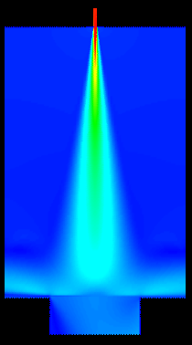
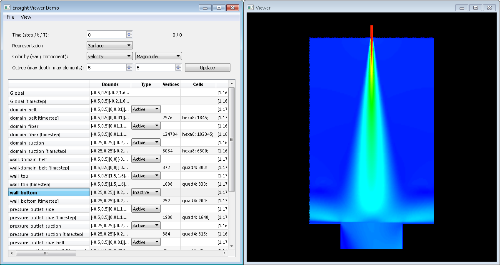
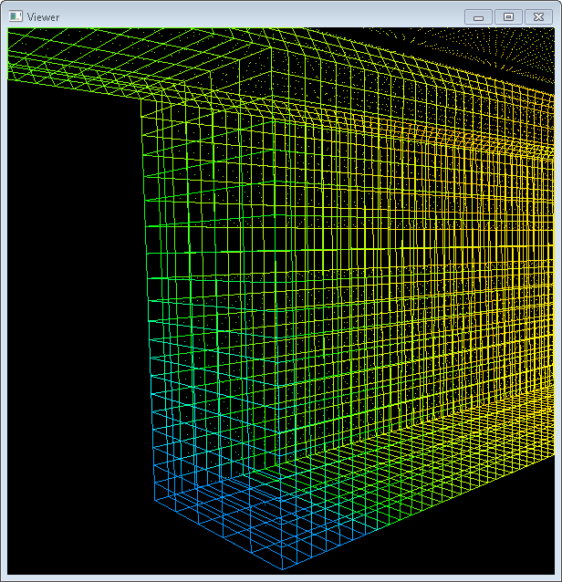

# Ensight4Matlab

Ensight4Matlab let's you read, process, and write files in EnSight Gold format from your C++ or MATLAB&reg; code.


The Ensight Gold format represents a 3D mesh and variable fields defined over the domain of this mesh. The mesh and/or variables may be either static in time or time-varying. The Ensight Gold format is used to save e.g. CFD and CAE data, and widely supported by many software tools. It is specified by CEI software, Inc., see http://www.ceisoftware.com for more details.<br>
This packages provides a C++ based library to process e.g. CFD data sets in Ensight Format, which you can directly link (statically or dynamically) to your application. Additionally, it provides a language binding for MATLAB to easily use the C++ library in your MATLAB scripts, e.g. for analysis and rapid protoyping.


Table of Contents
=================

  * [Installation](#installation)
    * [Requirements](#requirements)
    * [Building the EnsightLib C++ library](#building-the-ensightlib-c-library)
    * [Building the MATLAB interface](#building-the-matlab-interface)
  * [Usage](#usage)
    * [Overview](#overview)
    * [C++ Usage](#c-usage)
    * [MATLAB Usage](#matlab-usage)
    * [Point location and variable interpolation](#point-location-and-variable-interpolation)
  * [License](#license)
  * [Contributors](#contributors)


Installation
============

The Ensight4Matlab package consists of two major parts, a C++ library and a wrapper which provides a MATLAB language binding. The C++ library can be used on its own, whereas the MATLAB wrapper needs the C++ library installed first.

Requirements
------------

The C++ library has dependencies on the following third party libraries:
  * Eigen (version >= 3.2): A fast, header-only library for linear algebra, available at http://eigen.tuxfamily.org/
  * Qt, either version 4 or 5.

  For use with MATLAB, Qt 4 is recommended. (see below)
  * OpenGL is needed for the [example application](#c-usage).

The MATLAB wrapper depends on a compiled version of the C++ library and needs the MEX compiler to compile the MATLAB/C++ interface.

Warning:
MATLAB ships with its own Qt 5 library which may be a different minor version than the one installed on your system. This may lead to version conflicts if you compile the C++ Ensight library with a Qt 5 version higher than the one provided by MATLAB. In this case, we recommend you compile with Qt 4 to avoid conflicts. Additionally, we have experienced stability problems with the R2015a/b releases of MATLAB, so we recommend against using Ensight4Matlab with these releases.

Building the EnsightLib C++ library
-----------------------------------
The EnsightLib library uses the Qt qmake build system. From the directory `ensight_lib` first run qmake to create a Makefile, then run make.
```bash
> qmake-qt4 EnsightLib.pro
> make
```
This will create a file `libEnsightLib.so` in `ensight_lib/lib` (or a dll on Windows). The qmake-based Makefile does not create a target for `make install`, so you have to manually copy or link the .so file to e.g. `/usr/lib` if you want to make it globally accessible on your machine.

If you use a locally installed version of the Eigen library, you have to edit the include path defined in EnsightLib.pro. The corresponding line is:
```
# Include path to Eigen library: must contain the directory "Eigen/Dense"
INCLUDEPATH += /usr/local/include
```
You can also edit the .pro file to compile a static library (instead of an .so) by uncommenting the config option:
```
CONFIG += staticlib
```

Building the MATLAB interface
-----------------------------
To build the MATLAB interface, you need to make sure MATLAB can find the EnsightLib library. For this, you can either build the library as described above and copy it to a location in the global library search path, or use it from a local directory by specifying the `LD_LIBRARY_PATH` environment variable (Linux systems). For example, if the path to your compiled library is `/home/USER/Ensight4Matlab/ensight_lib/lib/libEnsightLib.so`, you would set the following:
```bash
> export LD_LIBRARY_PATH=/home/USER/Ensight4Matlab/ensight_lib/lib/:${LD_LIBRARY_PATH}
```
This needs to be set before you start MATLAB.

Building the MATLAB interface is aided by two scripts: `SETUP.m` and `runmex.m`. In MATLAB, navigate to the `EnsightMatlab` directory containing these scripts, then run `SETUP` first followed by `runmex`.

The SETUP script will ask you to specify several include and library paths. These paths refer to:
  * QT_INCLUDE_PATH: The include files for Qt, e.g. `/usr/include`
  * QT_LIB_PATH: The Qt libraries, e.g. `/usr/lib64`
  * EIGEN_PATH: The Eigen library. Same as used in your EnsightLib.pro
  * ENSIGHT_INCLUDE_PATH: The includes for the EnsightLib library, e.g. `../ensight_lib/include`
  * ENSIGHT_LIB_PATH: The path to your compiled EnsightLib library, same as specified in `LD_LIBRARY_PATH` above

Once you have specified these paths, call `runmex` to start the MEX compiler. If everything works, you get the message
```
MEX completed successfully.
```
You should also add the `EnsightMatlab` directory to your [MATLAB search path](https://www.mathworks.com/help/matlab/matlab_env/add-remove-or-reorder-folders-on-the-search-path.html) to ensure MATLAB can find it irrespective of the current working directoy. Now run the examples to test the installation.

Usage
=====

This package comes with a full [C++ application example](#c-usage) and two [MATLAB scripts](#matlab-usage) to demonstrate the usage of the library. For further details you can read the Doxygen documentation for the C++ library. The Matlab interface provides a list of available methods by typing `methods EnsightLib`, and help on the individual methods with `help EnsightLib.METHOD`, where _METHOD_ is any of the listed methods.

Overview
--------
A data set in EnSight Gold format describes 3D data. This data can either be _static_ or _transient_, i.e. time-varying. The data consists of mesh geometry, represented as an unstructured grid, and optionally variables defined over the domain of the mesh, as well as constants. The mesh's domain is partitioned into one _parts_. Variables can either be scalar or vector valued. For instance, the example data set `data/jet.encas` contains the variables _temperature_ and _velocity_, meaning each vertex of the mesh has a scalar temperature value and a 3D velocity vector.

The mesh is represented as follows: For each time step, the mesh consists of
 * A list of 3D vertex coordinates
 * A list of parts. In turn, each part contains lists of cells of different types, e.g. triangles, quadrangles, tetrahedra etc. Each cell is represented by indices into the coordinate list. For a complete list of available cell types see Figure 9-1 on page 9-6 of the [Ensight User Manual](http://www3.ensight.com/EnSight10_Docs/UserManual.pdf#page=632).

Note: The EnSight Gold specification also allows structured grids. However, this functionality is not yet implemented.

On the filesystem, a data set consists of several files:
  * A _case_ file: This is the main file of the data set and describes its structure. It also contains the names of additional files. Suffix is usually `.case` or `.encas`
  * One or more geometry files: Contains data of the mesh (vertex coordinates and connectivity) for each part and time step. Suffix is usually `.geo` or `.geom`
  * Optionally: one or more files for each variable

C++ Usage
---------

The directory `ensight_lib/examples/ensight_viewer` contains a demo application for the C++ library. This application is a simple OpenGL-based viewer for EnSight files. It is build using the qmake build process the same way as the EnsightLib library, see build instructions [build instructions above](#building-the-ensightlib-c-library).

Unpack the example data in `data/jet.tar.bz2` and load it in the viewer demo. You can see that the data consists of a several named parts, containing different types of cells (quadrangles, hexahedra), and several variables such as "temperature" and "velocity".


<div align=center>Figure 1: The Ensight Viewer demo shows the structure of the example data file (left) and a visualization of the "velocity" variable of all parts selected as "active" (right).</div>
<div align=center>
<br>
Figure 2: A zoomed view of the "temperature" variable in wireframe mode.</div>

In the main window (left) you can select a representation mode, and either coloring according to a variable or solid color. For data sets consisting of multiple time steps, you can also select which time step to display. The provided example data set is static, i.e. contains only a single time step.

The displayed table details the structure of the data set. For each part, there are two lines, one for the currently selected time step and one for the data in all time steps. The different columns describe the bounding box of the part, whether it is displayed in the viewer ("active"), how many vertices it contains, as well as which types of cells it contains. Also, there is a colum for each variable containing the min and max values of the variable in this part.

-------

All code dealing with the Ensight Library is in `mainwidget.cpp`, the rest is just visualization and boilerplate.
Basic usage is as follows:

A complete data set in Ensight format is represented by an Object of class `EnsightObj`. You can create a new (empty) object by using the default constructor, or load an existing file using:
```c++
std::string fileName = "data/jet.encas";
auto ensObject = EnsightLib::readEnsight(fileName);
```
Similiarly, you can then use
```c++
bool writeBinaryMode = true;
int timestepsToWrite = -1; // write all timesteps
EnsightLib::writeEnsight(ensObject, fileName, writeBinaryMode, timestepsToWrite);
```
to save the data to disk. Here, you can specify two additional parameters:
  * the parameter `writeBinaryMode` specifies whether the file is written as Ensight Binary format or as Ensight Ascii format.
  * for data sets containing multiple time steps, the `timestepsToWrite` parameter lets you save only a certain timestep, whereas passing -1 writes the complete data set. This is useful if your program generates data for time steps sequentially and you want to save only the new data as it is generated.

An object of class `EnsightObj` then provides access to the complete structure of the data set:
   * query the number of time steps (with method `getNumberOfTimesteps`), parts (`getNumberOfParts`), variables (`getNumberOfVariables`), and constants (`getNumberOfConstants`)
   * access a part for a given time step: `getPart` returns a pointer of type `EnsightPart`
     * `EnsightPart` gives access to the vertex coordinates, cell indices, and variable values of a part with `getVertices`, `getCells`, and `getVariables`, respectively
   * access values of constants with `getConstant`
   *  interpolate variable values for 3D point positions with `interpolate` (see [below](#point-location-and-variable-interpolation))

To change the data represented by the EnsightObj, you first have to call `beginEdit` to enter _edit mode_. You can then create new time steps, parts, variables, etc. and set vertex coordinates, cell indices and variable values. Once you are finished, call `endEdit` to leave edit mode. This will then run a few checks to test if the data is consistent and fail if any inconsistencies are found.
   
MATLAB Usage
------------

Once you have installed the Matlab interface and added it to your search path, you can access it by using the class `EnsightLib`. Constructing an object of this class without any parameters creates an empty data set:
```
>> newData = EnsightLib;
```
To load an existing file, pass the file name as argument:
```
>> jet = EnsightLib('data/jet.encas')

jet = 

  EnsightLib with properties:

              timeSteps: 0
               editMode: 0
        EnsightPartList: {13×2 cell}
      EnsightSubdivTree: [1×1 struct]
    EnsightVariableList: {6×3 cell}
              Constants: {0×2 cell}
```
The command `methods EnsightLib` gives an overview of available methods. Use `help` to get more information on individual methods. The directory `EnsightMatlab/examples` contains two examples showing how to:
 - Create a new object
 - Create parts
 - Add vertices, cells, and variables
 - Save the resulting object
 - Use `search` to query a point and `interpolateVariable` for interpolation (see below).


Point location and variable interpolation
-----------------------------------------
Two common tasks are, for a given point **x**, to locate which cell of the mesh contains **x** or to interpolate variable values given at the cell vertices to a value at **x**. While not directly related to the Ensight format, this package provides this functionality for convenience.

To achieve fast cell lookup, the cells of the mesh can be sorted into a spatial subdivision data structure. The implementation either uses an Octree for 3D data or a Quadtree for 2D data in the Z=0 plane. Given a point **x**, we can then use this subdivision to find the cell containing this point.

For convenience, the Matlab interface automatically creates the octree when needed. Using the C++ side, the octree needs to be explicitly created before it can be used to query point locations. For example:
```c++
EnsightObj* ensObj = ...
int maxDepth = 7;            // tree is at most 7 levels deep
int maxCellsPerLevel = 50;   // For levels < 7, subdivide after 50 cells
QStringList partsToExclude;  // empty list, don't exclude any parts
ensObject->createSubdivTree(maxDepth, maxCellsPerLevel, partsToExclude);
```
Cell lookup can then be achieved by either
```c++
Vec3 x(0, 0, 0); // example coordinates to query
auto* cell = ensObj->interpolate(x);
```
or alternatively
```c++
EnsightBarycentricCoordinates baryCoords;  // output parameter for point coords
auto* cell = ensObj->interpolate(x, baryCoords);
```
The latter call also computes the [barycentric coordinates](https://en.wikipedia.org/wiki/Barycentric_coordinate_system) of the query point with respect to the located cell. 

The barycentric coordinates can be used for interpolation of variable values: Variables defined over a cell are given by their values at cell vertices. By computing a weighted sum of vertex values, we get a linear interpolation. That is, given values _v_<sub>_i_</sub> at vertex _i_, and corresponding coordinates _b_<sub>_i_</sub>, we get the interpolated value _w_ as the scalar product _w_ = \<_v_, _b_\>.

The Matlab interface comes with a convenience method that does all of this in one call: It creates the spatial subdivision data structure (if it doesn't already exist), does cell lookup, and interpolates a given variable using the resulting barycentric coordinates for a query point:
```
>> jet = EnsightLib('data/jet.encas');
>> t = jet.interpolateVariable([0, 0, 0]', 'temperature')

t =

  301.5740
```


License
=======
This package is copyright &copy; Fraunhofer ITWM and licensed under the MIT License. For details see [LICENSE](LICENSE).

The MATLAB wrapper uses the third party file "[class_handle.hpp](EnsightMatlab/mexfiles/class_handle.hpp)", which is copyright &copy; 2012, Oliver Woodford, and licensed under the 2-Clause BSD [License](EnsightMatlab/mexfiles/LICENSE.txt).

MATLAB is a registered trademark of The MathWorks, Inc. (see www.mathworks.com/trademarks). Ensight is a trademark of Computational Engineering International, Inc.


This package is an independent project and in no way affiliated with The MathWorks, Inc. or Computational Engineering International, Inc. All trademarks are property of their respective owners.

Contributors
============

Andre Schmeißer, Daniel Burkhart, Dominik Linn, Johannes Schnebele, Manuel Ettmüller, Simone Gramsch, Walter Arne
